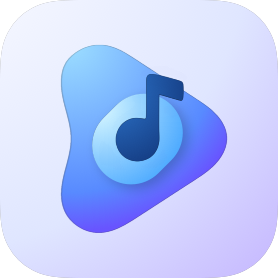
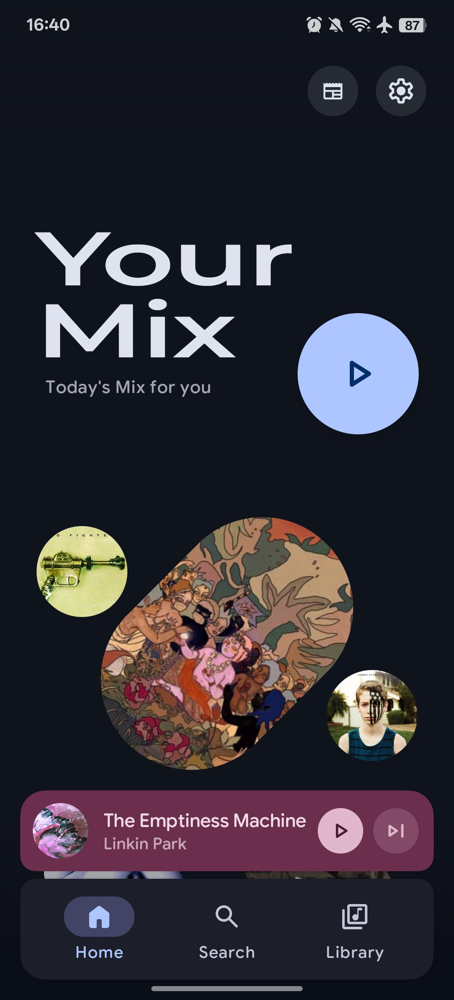
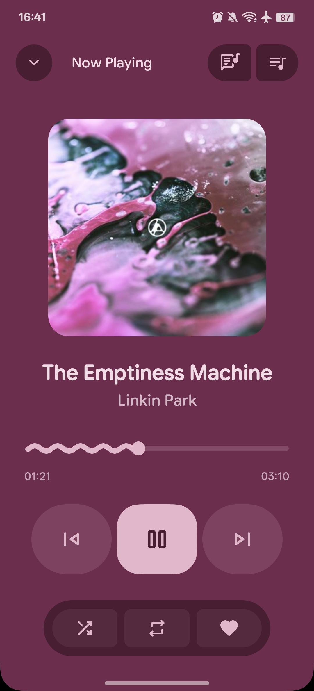
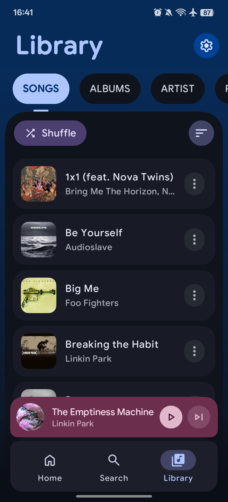
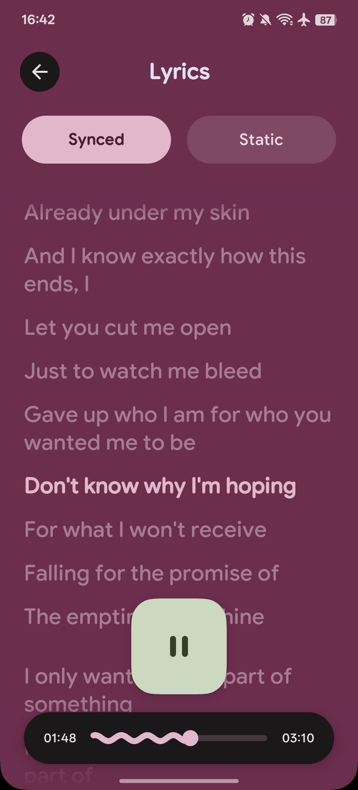

# PixelPlayer 🎵

<p align="center">
  
</p>

<p align="center">
  <strong>A beautiful, feature-rich music player for Android</strong><br>
  Built with Jetpack Compose and Material Design 3
</p>

<p align="center">
  
  
  
  
</p>

<p align="center">
    <a href="https://github.com/theovilardo/PixelPlayer/releases/latest">
        
    </a>
    <a href="https://github.com/theovilardo/PixelPlayer/releases">
        
    </a>
    
    
</p>

---

## ‼️ DISCLAIMER
- No fork of this project will recieve support, if you use a fork, ask the forker to support you.

---

## ✨ Features

### 🎨 Modern UI/UX
- **Material You** - Dynamic color theming that adapts to your wallpaper
- **Smooth Animations** - Fluid transitions and micro-interactions
- **Customizable UI** - Adjustable corner radius and navigation bar settings
- **Dark/Light Theme** - Automatic or manual theme switching
- **Album Art Colors** - Dynamic color extraction from album artwork

### 🎵 Powerful Playback
- **Media3 ExoPlayer** - Industry-leading audio engine with FFmpeg support
- **Background Playback** - Full media session integration
- **Queue Management** - Drag-and-drop reordering
- **Shuffle & Repeat** - All playback modes supported
- **Gapless Playback** - Seamless transitions between tracks
- **Custom Transitions** - Configure crossfades between songs

### 📚 Library Management
- **Multi-format Support** - MP3, FLAC, AAC, OGG, WAV, and more
- **Browse By** - Songs, Albums, Artists, Genres, Folders
- **Smart Artist Parsing** - Configurable delimiters for multi-artist tracks
- **Album Artist Grouping** - Proper album organization
- **Folder Filtering** - Choose which directories to scan

### 🔍 Discovery & Organization
- **Full-text Search** - Search across your entire library
- **Daily Mix** - AI-powered personalized playlist based on listening habits
- **Playlists** - Create and manage custom playlists
- **Statistics** - Track your listening history and habits

### 🎤 Lyrics
- **Synchronized Lyrics** - LRC format via LRCLIB API
- **Lyrics Editing** - Modify or add lyrics to your tracks
- **Scrolling Display** - Follow along as you listen

### 🖼️ Artist Artwork
- **Deezer Integration** - Automatic artist images from Deezer API
- **Smart Caching** - Memory (LRU) + database caching for offline access
- **Fallback Icons** - Beautiful placeholders when images unavailable

### 📲 Connectivity
- **Chromecast** - Stream to your TV or smart speakers
- **Android Auto** - Full Android Auto support for in-car playback (Soon)
- **Widgets** - Home screen control with Glance widgets

### ⚙️ Advanced Features
- **Tag Editor** - Edit metadata with TagLib (MP3, FLAC, M4A support)
- **AI Playlists** - Generate playlists with Gemini AI
- **Audio Waveforms** - Visual representation with Amplituda (Soon)

---

## 🛠️ Tech Stack

| Category | Technology |
|----------|------------|
| **Language** | [Kotlin](https://kotlinlang.org/) 100% |
| **UI Framework** | [Jetpack Compose](https://developer.android.com/jetpack/compose) |
| **Design System** | [Material Design 3](https://m3.material.io/) |
| **Audio Engine** | [Media3 ExoPlayer](https://developer.android.com/guide/topics/media/media3) + FFmpeg |
| **Architecture** | MVVM with StateFlow/SharedFlow |
| **DI** | [Hilt](https://dagger.dev/hilt/) |
| **Database** | [Room](https://developer.android.com/training/data-storage/room) |
| **Networking** | [Retrofit](https://square.github.io/retrofit/) + OkHttp |
| **Image Loading** | [Coil](https://coil-kt.github.io/coil/) |
| **Async** | Kotlin Coroutines & Flow |
| **Background Tasks** | WorkManager |
| **Metadata** | [TagLib](https://github.com/nicholaus/taglib-android) |
| **Widgets** | [Glance](https://developer.android.com/jetpack/compose/glance) |

---

## 📱 Requirements

- **Android 11** (API 30) or higher
- **4GB RAM** recommended for smooth performance

---

## 🚀 Getting Started

### Prerequisites

- Android Studio Ladybug | 2024.2.1 or newer
- Android SDK 29+
- JDK 11+

### Installation

1. **Clone the repository**
   ```sh
   git clone https://github.com/theovilardo/PixelPlayer.git
   ```

2. **Open in Android Studio**
   - Open Android Studio
   - Select "Open an Existing Project"
   - Navigate to the cloned directory

3. **Sync and Build**
   - Wait for Gradle to sync dependencies
   - Build the project (Build → Make Project)

4. **Run**
   - Connect a device or start an emulator
   - Click Run (▶️)

---

## ⬇️ Download

<p align="center">
  <a href="https://github.com/theovilardo/PixelPlayer/releases/latest">
    
  </a>
</p>

<p align="center">
  <a href="https://apps.obtainium.imranr.dev/redirect?r=obtainium://app/%7B%22id%22%3A%22com.theveloper.pixelplay%22%2C%22url%22%3A%22https%3A%2F%2Fgithub.com%2Ftheovilardo%2FPixelPlayer%22%2C%22author%22%3A%22theovilardo%22%2C%22name%22%3A%22PixelPlayer%22%2C%22supportFixedAPKURL%22%3Afalse%7D">
    
  </a>
</p>

---

## 📂 Project Structure

```
app/src/main/java/com/theveloper/pixelplay/
├── data/
│   ├── database/       # Room entities, DAOs, migrations
│   ├── model/          # Domain models (Song, Album, Artist, etc.)
│   ├── network/        # API services (LRCLIB, Deezer)
│   ├── preferences/    # DataStore preferences
│   ├── repository/     # Data repositories
│   ├── service/        # MusicService, HTTP server
│   └── worker/         # WorkManager sync workers
├── di/                 # Hilt dependency injection modules
├── presentation/
│   ├── components/     # Reusable Compose components
│   ├── navigation/     # Navigation graph
│   ├── screens/        # Screen composables
│   └── viewmodel/      # ViewModels
├── ui/
│   ├── glancewidget/   # Home screen widgets
│   └── theme/          # Colors, typography, theming
└── utils/              # Extensions and utilities
```

---

## 🤝 Contributing

Contributions are welcome! Please feel free to submit a Pull Request.

1. Fork the Project
2. Create your Feature Branch (`git checkout -b feature/AmazingFeature`)
3. Commit your Changes (`git commit -m 'Add some AmazingFeature'`)
4. Push to the Branch (`git push origin feature/AmazingFeature`)
5. Open a Pull Request

---

## 📄 License

This project is licensed under the MIT License - see the [LICENSE](LICENSE) file for details.

---

<p align="center">
  Made with ❤️ by <a href="https://github.com/theovilardo">theovilardo</a>
</p>
