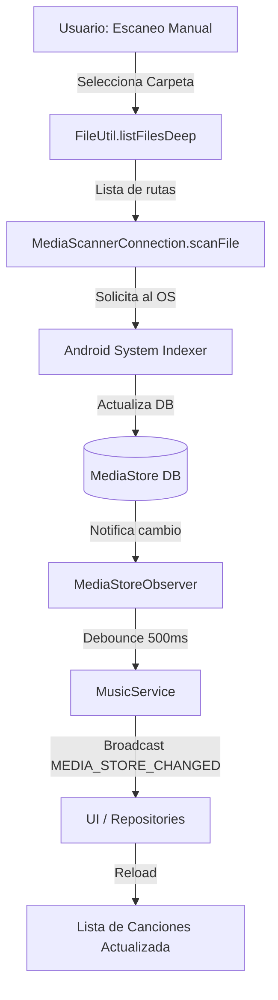

# Lógica de Escaneo e Indexación de Archivos de Música

## Resumen Ejecutivo

Este documento detalla la estrategia técnica utilizada para el descubrimiento, indexación y actualización de archivos de música en la aplicación. La arquitectura se basa en delegar la responsabilidad del escaneo profundo al sistema operativo Android a través de **MediaStore**, utilizando la aplicación como una capa de visualización y control.

La estrategia prioriza la **eficiencia de recursos** (batería y CPU) y la **consistencia con el sistema**, evitando mantener una base de datos paralela compleja. Las actualizaciones se manejan mediante un modelo reactivo: la aplicación "escucha" cambios en el sistema y reacciona actualizando la UI, además de proveer mecanismos manuales para forzar la indexación de nuevos archivos.

---

## 1. Primer Escaneo (Cold Start)

Al iniciar la aplicación por primera vez, no se realiza un "escaneo" recursivo tradicional del sistema de archivos. En su lugar, se consulta el índice centralizado de Android (`MediaStore`).

### Descubrimiento de Archivos
La aplicación consulta la base de datos de `MediaStore` a través de `ContentResolver`. Esto es instantáneo comparado con recorrer el sistema de archivos.

*   **Fuente de Verdad:** `MediaStore.Audio.Media.EXTERNAL_CONTENT_URI` (o `getContentUri(MediaStore.VOLUME_EXTERNAL)` en Android Q+).
*   **Permisos Requeridos:** `READ_EXTERNAL_STORAGE` (o `READ_MEDIA_AUDIO` en Android 13+).

### Filtros y Validación
Para asegurar que solo se muestren archivos de música relevantes, se aplican filtros estrictos en la consulta SQL (`SongRepository.kt`).

1.  **Es Música:** Se verifica la columna `IS_MUSIC` y que el título no esté vacío.
    ```kotlin
    // Constants.kt
    const val IS_MUSIC = MediaStore.Audio.AudioColumns.IS_MUSIC + "=1" + 
                         " AND " + MediaStore.Audio.AudioColumns.TITLE + " != ''"
    ```
2.  **Duración:** Se filtran clips de audio muy cortos (configuración de usuario, por defecto suele filtrar audios de notificaciones).
    ```kotlin
    // SongRepository.kt
    selectionFinal = selectionFinal + " AND " + Media.DURATION + ">= " + (PreferenceUtil.filterLength * 1000)
    ```
3.  **Lista Negra (Blacklist):** Se excluyen rutas específicas definidas por el usuario (`BlacklistStore`).
    ```kotlin
    // SongRepository.kt
    if (paths.isNotEmpty()) {
        selectionFinal = generateBlacklistSelection(selectionFinal, paths.size)
        // ... agrega parámetros NOT LIKE ? para cada ruta
    }
    ```

### Extracción de Metadatos
Los metadatos no se extraen leyendo los archivos (como ID3 tags) directamente en este paso, sino que se obtienen de las columnas ya indexadas por `MediaStore`. Esto incluye:
*   Título, Artista, Álbum
*   Duración, Año, Número de Pista
*   Ruta del archivo (`_data`)
*   Fecha de modificación

---

## 2. Actualizaciones (Delta / Incremental Scanning)

El sistema está diseñado para reaccionar a cambios en tiempo real sin necesidad de polling (consultas periódicas).

### Detección de Cambios
La aplicación registra un `ContentObserver` para monitorear las URIs de `MediaStore`.

*   **Componente:** `MediaStoreObserver.kt`
*   **Servicio:** `MusicService.kt`
*   **Mecanismo:**
    1.  `MusicService` inicia y registra `MediaStoreObserver`.
    2.  Cuando el SO notifica un cambio en `MediaStore`, el observer recibe `onChange`.
    3.  Se aplica un **Debounce** de 500ms para evitar múltiples actualizaciones consecutivas rápidas.

```kotlin
// MediaStoreObserver.kt
override fun onChange(selfChange: Boolean) {
    mHandler.removeCallbacks(this)
    mHandler.postDelayed(this, REFRESH_DELAY) // 500ms
}

override fun run() {
    musicService.handleAndSendChangeInternal(MusicService.MEDIA_STORE_CHANGED)
}
```

### Propagación de Cambios
Una vez confirmado el cambio, se emite un **Broadcast Local** (`MEDIA_STORE_CHANGED`) a toda la app.

1.  `MusicService` envía el broadcast.
2.  Actividades y Fragmentos (ej: `AbsMusicServiceActivity`) escuchan este broadcast.
3.  Los repositorios (`SongRepository`, `AlbumRepository`, etc.) invalidan sus datos o simplemente se vuelven a consultar para refrescar la lista.

### Escaneo Manual (Forzado)
Si el usuario agrega archivos y `MediaStore` no los detecta automáticamente, la app permite un escaneo manual de carpetas específicas (`FoldersFragment`).

*   **Flujo:**
    1.  Usuario selecciona "Escanear" en una carpeta.
    2.  `FileUtil.listFilesDeep` lista recursivamente todos los archivos de audio en esa ruta.
    3.  Se invoca `MediaScannerConnection.scanFile` pasando la lista de rutas.
    4.  Esto fuerza al sistema operativo a leer e indexar esos archivos específicos.
    5.  Al terminar, el sistema dispara la notificación de `MediaStore`, lo que activa el `MediaStoreObserver` (paso anterior), actualizando la UI globalmente.



---

## 3. Mantenimiento en el tiempo

### Ciclo de Vida del Índice
La app no mantiene un índice persistente propio de las canciones (salvo cachés temporales o datos derivados como "Historial" o "Conteo de Reproducciones" en `RoomRepository`).
*   **Persistencia:** La "verdad" reside en `MediaStore`. Si se borran datos de la app, la música sigue ahí.
*   **Invalidación:** Automática al recibir el broadcast de cambio.

### Cambios de Almacenamiento
*   **Montaje/Desmontaje SD:** `MediaStore` maneja automáticamente la disponibilidad de volúmenes externos. Si la SD se quita, las consultas a `MediaStore` dejarán de devolver esos archivos.
*   **Permisos Revocados:** Si se pierde el permiso de almacenamiento, `SongRepository` captura la `SecurityException` y devuelve listas vacías, evitando crashes.

```kotlin
// SongRepository.kt
try {
    context.contentResolver.query(...)
} catch (ex: SecurityException) {
    return null
}
```

---

## 4. Eficiencia y Performance

### Justificación
Esta arquitectura es altamente eficiente porque:
1.  **No duplica trabajo:** El SO ya escanea archivos. Hacerlo de nuevo gastaría doble batería y I/O.
2.  **Memoria Baja:** No se cargan listas masivas de objetos en memoria permanentemente; se usan cursores y listas bajo demanda.
3.  **IO Asíncrono:** Las consultas pesadas se hacen fuera del hilo principal (usando Coroutines o Loaders).

### Complejidad
*   **Cold Start:** O(1) relativo al I/O del disco, ya que es una consulta SQL indexada.
*   **Actualización:** O(N) donde N es el número de archivos a re-listar en la UI, pero filtrado por la consulta SQL eficiente.

### Estrategia de Ejecución
*   **Background:** El `MediaScannerConnection` corre asíncronamente en el proceso del sistema.
*   **UI Thread:** La UI solo se entera cuando el trabajo terminó. El `ScanMusicBottomSheet` muestra progreso basado en los callbacks de `MediaScannerConnection`.

---

## 5. Casos de Uso y Escenarios Edge

### Biblioteca Grande (10k+ canciones)
*   **Comportamiento:** `MediaStore` maneja volúmenes grandes eficientemente. El uso de `Cursor` permite iterar sin cargar todo en RAM si se implementa paginación (aunque actualmente `RealSongRepository` carga la lista en memoria, lo cual podría ser un punto de optimización futura para librerías extremas).

### Archivos Inconsistentes
*   **Metadatos Faltantes:** Si `MediaStore` tiene campos nulos, la app provee valores por defecto (ej: "Unknown Artist") en el mapeo `getSongFromCursorImpl`.
*   **Archivos "Fantasma":** Si un archivo existe en la DB pero no en disco, la reproducción fallará. La app captura esto y muestra un Toast "Unplayable file".

### App en Segundo Plano
*   El `MusicService` sigue vivo y el `MediaStoreObserver` activo. Si se agregan canciones mientras se escucha música, la cola de reproducción actual no se altera automáticamente, pero la biblioteca se actualizará para la próxima navegación.

---

## 6. Consumo de Recursos

*   **Batería:** Mínimo. Solo despierta la CPU brevemente para procesar el broadcast de cambio. El escaneo pesado lo hace el sistema con sus propias políticas de optimización.
*   **RAM:** Depende del tamaño de la lista de canciones cargada en `SongRepository`.
*   **I/O:** Muy bajo en lectura normal. Alto solo durante el "Escaneo Manual" de una carpeta profunda.

---

## 7. Cómo portarlo a otro proyecto

Para replicar esta lógica en otro proyecto Android:

1.  **Dependencias:** Ninguna librería externa crítica. Solo APIs nativas de Android (`ContentResolver`, `MediaStore`, `MediaScannerConnection`).
2.  **Permisos:** Configurar `AndroidManifest.xml` con `READ_EXTERNAL_STORAGE` / `READ_MEDIA_AUDIO`.
3.  **Copiar Clases Core:**
    *   `SongRepository`: Interfaz con `MediaStore`.
    *   `MediaStoreObserver`: El "oído" del sistema.
    *   `MusicService` (parte relevante): Para registrar el observer y distribuir el evento.
4.  **Implementar UI Reactiva:** Asegurar que los ViewModels o Presenters recarguen datos al recibir la señal de cambio.

### Puntos Personalizables
*   **Filtros SQL:** Ajustar el `selection` en `SongRepository` para incluir otros tipos de audio (podcasts, grabaciones) o cambiar el límite de duración.
*   **Debounce:** Ajustar el tiempo en `MediaStoreObserver` (actualmente 500ms) según la reactividad deseada vs. consumo.

---

## Observaciones y Mejoras

*   **Carga en Memoria:** `RealSongRepository.songs()` carga todos los objetos `Song` en una `ArrayList`. Para librerías masivas (>50k canciones), esto podría causar presión de memoria. **Mejora:** Implementar `Paging 3` o cargar datos bajo demanda desde el Cursor directamente en el Adapter.
*   **Validación de Archivos:** No se verifica la existencia física del archivo (`File.exists()`) al cargar la lista desde `MediaStore` para no impactar el rendimiento (I/O bloqueante). Esto es correcto por performance, pero requiere manejo de errores robusto al intentar reproducir.

---

## ✅ Checklist de implementación

Esta lista sirve como guía paso a paso para implementar la lógica de escaneo e indexación en un nuevo proyecto.

### Fase 1: Arquitectura y Configuración
1.  [ ] **Definir Repositorio de Canciones** `(CRÍTICO)`
    *   Crear una interfaz `SongRepository` que abstraiga el acceso a datos. No acceder a `MediaStore` directamente desde la UI.
2.  [ ] **Configurar Permisos en Manifest** `(CRÍTICO)`
    *   Declarar `READ_EXTERNAL_STORAGE` (Android 12-) y `READ_MEDIA_AUDIO` (Android 13+).
3.  [ ] **Implementar Manejo de Permisos en Runtime**
    *   Solicitar permisos antes de la primera consulta. Manejar el caso "Permiso denegado".

### Fase 2: Descubrimiento e Indexación (Cold Start)
4.  [ ] **Implementar consulta SQL base** `(CRÍTICO)`
    *   Construir la query con `MediaStore.Audio.Media.EXTERNAL_CONTENT_URI` y proyección eficiente.
5.  [ ] **Aplicar filtros de validez**
    *   Filtrar por `IS_MUSIC != 0` y `TITLE != ''`.
6.  [ ] **Filtrar por duración mínima**
    *   Excluir audios < 30s (o configurable) para evitar audios de WhatsApp/notificaciones.
7.  [ ] **Mapear Cursor a Modelo**
    *   Extraer ID, Título, Artista, Álbum, Path, Duración. Manejar nulos con valores por defecto ("Unknown").

### Fase 3: Actualización Incremental y Background
8.  [ ] **Implementar ContentObserver** `(CRÍTICO)`
    *   Crear clase que herede de `ContentObserver` y escuche URIs de `MediaStore`.
9.  [ ] **Configurar Debounce**
    *   Añadir delay (ej: 500ms) en el observer para agrupar múltiples notificaciones del sistema en una sola actualización.
10. [ ] **Implementar Broadcast Local**
    *   Emitir evento (ej: `MEDIA_STORE_CHANGED`) cuando el observer confirme cambios.
11. [ ] **Suscripción de UI**
    *   Hacer que Fragments/Activities recarguen datos al recibir el broadcast.

### Fase 4: Escaneo Manual
12. [ ] **Implementar listado recursivo de archivos**
    *   Función utilitaria (`FileUtil`) que recorra directorios y encuentre archivos con mime-type de audio.
13. [ ] **Conectar con MediaScannerConnection** `(CRÍTICO)`
    *   Invocar `MediaScannerConnection.scanFile()` con la lista de paths encontrados.
14. [ ] **Manejar Callback de escaneo**
    *   Monitorear `onScanCompleted` para actualizar progreso o notificar finalización.

### Fase 5: Robustez y Mantenimiento
15. [ ] **Manejar SecurityException** `(CRÍTICO)`
    *   Capturar excepciones al consultar el ContentResolver (ej: si el usuario revoca permisos mientras la app corre).
16. [ ] **Validar Blacklist**
    *   Implementar lógica para excluir carpetas específicas seleccionadas por el usuario.
17. [ ] **Manejo de SD Card**
    *   Verificar estado de montaje antes de consultar volúmenes externos.

---

## 🧪 Matriz de casos de prueba

Utilice esta matriz para validar la robustez del sistema de escaneo en diferentes escenarios.

| ID | Escenario | Precondiciones | Acción | Resultado esperado | Tipo | Prioridad | Notas/Observabilidad |
|:---|:---|:---|:---|:---|:---|:---|:---|
| **TC01** | **Cold Start (Instalación Limpia)** | App recién instalada, sin caché. Música en dispositivo. | Abrir App y conceder permisos. | Lista de canciones se carga completa. No faltan archivos válidos. | E2E | **Alta** | Medir tiempo desde permiso hasta carga UI. |
| **TC02** | **Permiso Denegado** | App recién instalada. | Abrir App, denegar permiso de almacenamiento. | UI muestra estado vacío (Empty State) con botón para reintentar/pedir permiso. No crash. | E2E | **Alta** | Verificar logs de `SecurityException` controlada. |
| **TC03** | **Permiso Revocado en Runtime** | App con permisos y canciones cargadas. | Ir a Ajustes Android -> Revocar permisos -> Volver a App. | App detecta falta de permiso, limpia lista y pide permiso nuevamente o muestra error. | E2E | Media | |
| **TC04** | **Nuevo Archivo (Externo)** | App abierta en segundo plano. | Copiar MP3 a carpeta Music usando File Explorer. | App actualiza lista automáticamente tras unos segundos (sin reiniciar). | Integration | **Alta** | Verificar disparo de `MediaStoreObserver`. |
| **TC05** | **Borrado de Archivo (Externo)** | App abierta. | Borrar MP3 desde File Explorer. | Canción desaparece de la lista en la App. | Integration | **Alta** | |
| **TC06** | **Cambio de Metadatos** | App abierta. | Editar tags (Título/Artista) con otra App. | App refleja nuevos metadatos automáticamente. | Integration | Media | Verificar consistencia de caché si existe. |
| **TC07** | **Escaneo Manual Exitoso** | Carpeta con música no indexada por OS (ej: `.nomedia` eliminado). | Ejecutar "Escanear carpeta" en esa ruta. | Archivos aparecen en la biblioteca global tras finalizar. | Unit/Int | Media | Validar llamada a `MediaScannerConnection`. |
| **TC08** | **Escaneo Manual Cancelado** | Operación de escaneo en curso. | Salir de la pantalla / Matar proceso. | No debe haber crash. El escaneo puede quedar incompleto pero el sistema no debe corromperse. | Unit | Baja | |
| **TC09** | **Filtro de Duración** | Archivos de audio de 5s, 10s y 3m en disco. Configuración: >30s. | Realizar escaneo / Cold start. | Solo se muestra el archivo de 3m. Los cortos se ignoran. | Unit | Media | Verificar query SQL `duration >= X`. |
| **TC10** | **Lista Negra (Blacklist)** | Carpeta "WhatsApp Audio" en blacklist. | Cold Start o Rescan. | Archivos de esa carpeta no aparecen en la biblioteca. | Unit | Media | Verificar cláusulas `NOT LIKE` en SQL. |
| **TC11** | **Biblioteca Grande (10k+ canciones)** | Dispositivo con >10,000 archivos de audio. | Iniciar App. | Carga en tiempo razonable (<3-5s en gama media). UI no se congela (ANR). | Performance | **Alta** | Medir memoria pico y tiempo de carga. |
| **TC12** | **Archivo Corrupto** | Archivo con header MP3 inválido pero extensión .mp3. | Iniciar App / Reproducir. | Aparece en lista (si MediaStore lo indexó) pero al reproducir muestra "Unplayable file". No crash. | E2E | Baja | Manejo de error en Player. |
| **TC13** | **Metadatos Incompletos** | MP3 sin tags ID3. | Iniciar App. | Se muestra como "Unknown Artist" / Nombre de archivo como título. | Unit | Media | |
| **TC14** | **Duplicados** | Mismo archivo en dos rutas diferentes. | Iniciar App. | Se muestran ambas entradas (la app se basa en `_data` path único). | Unit | Baja | |
| **TC15** | **SD Card Desmontada** | Música en SD Card externa. | Desmontar SD físicamente o por software. | Canciones de SD desaparecen de la lista. | E2E | Media | `MediaStore` actualiza volumen automáticamente. |
| **TC16** | **SD Card Montada** | App abierta. | Insertar SD con música. | Canciones aparecen automáticamente. | E2E | Media | |
| **TC17** | **Low Memory / Process Kill** | App en background. | Sistema mata la app por memoria. Abrir App de nuevo. | Estado se restaura correctamente, lista se recarga desde cero. | E2E | Media | Verificar `onSaveInstanceState` si aplica. |
| **TC18** | **Stress Test de Actualizaciones** | Script que crea/borra 100 archivos por segundo. | App abierta. | UI se actualiza eventualmente (gracias al debounce) sin congelarse ni crashear. | Stress | Baja | Verificar efectividad del Debounce (500ms). |
| **TC19** | **Consistencia DB vs Disco** | Borrar archivo manualmente sin pasar por MediaStore (adb shell rm). | Intentar reproducir esa canción en la App. | Error controlado "File not found" o "Unplayable". | E2E | Media | La app confía en MediaStore, que puede estar desactualizado. |
| **TC20** | **Formatos No Estándar** | Archivos .ogg, .flac, .wav. | Iniciar App. | Se listan y reproducen correctamente (si el dispositivo lo soporta). | Integration | Media | |
